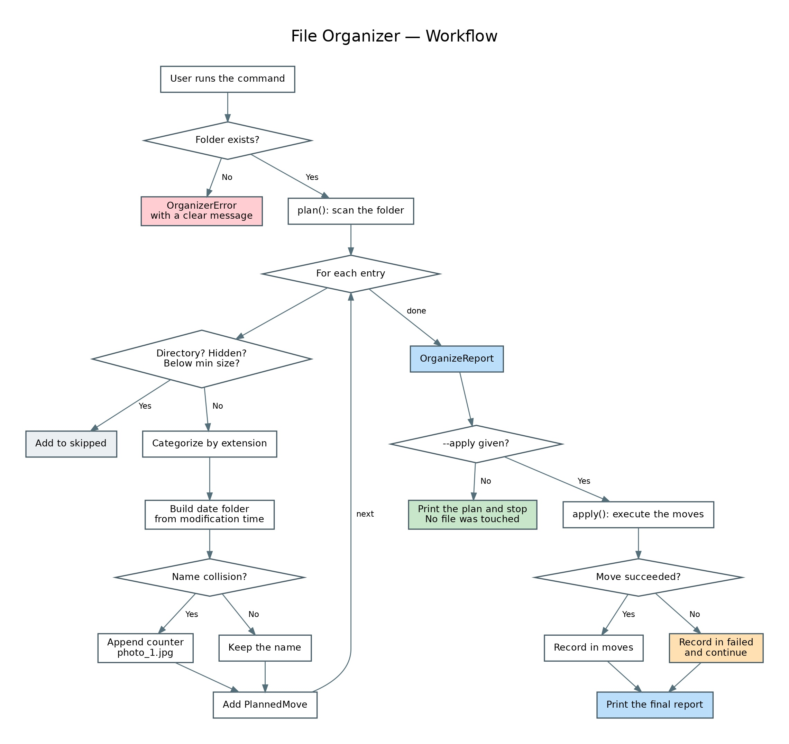

# File Organizer


A command-line tool that tidies a cluttered folder by sorting files into category and date sub-folders — with a dry run by default, so nothing moves until you say so.

## The Problem

A Downloads folder accumulates hundreds of unrelated files: invoices next to screenshots, installers next to spreadsheets. Sorting them by hand is tedious, and most "cleanup" scripts move files immediately — one wrong path and your files are scattered somewhere you did not intend.

This tool solves both halves of that problem: it groups files by **what they are** and **when they arrived**, and it **shows you the plan before touching anything**.

## Example

```console
$ python -m organizer.cli ~/Downloads

INFO     planned 11 moves, skipped 0

PLAN (dry run)
============================================================
  backup.zip
    -> archives/2026-08/backup.zip
  beach.png
    -> images/2026-08/beach.png
  budget.xlsx
    -> spreadsheets/2026-08/budget.xlsx
  contract.pdf
    -> documents/2026-06/contract.pdf
  invoice.pdf
    -> documents/2026-06/invoice.pdf
  movie.mp4
    -> video/2026-08/movie.mp4
  mystery.xyz
    -> other/2026-08/mystery.xyz
  notes.txt
    -> documents/2026-08/notes.txt
  script.py
    -> code/2026-08/script.py
  song.mp3
    -> audio/2026-08/song.mp3
  vacation.jpg
    -> images/2025-11/vacation.jpg
------------------------------------------------------------
  archives            1 files
  audio               1 files
  code                1 files
  documents           3 files
  images              2 files
  other               1 files
  spreadsheets        1 files
  video               1 files
------------------------------------------------------------
  11 files, 331.0 B

  Run again with --apply to move the files.
```

Once the plan looks right:

```console
$ python -m organizer.cli ~/Downloads --apply
```

Resulting layout:

```
Downloads/
├── images/
│   ├── 2025-11/vacation.jpg
│   └── 2026-08/beach.png
├── documents/
│   ├── 2026-06/invoice.pdf
│   └── 2026-08/notes.txt
├── archives/2026-08/backup.zip
└── other/2026-08/mystery.xyz
```

## Installation

```bash
git clone https://github.com/Eng-Rami-Khzam/file-organizer.git
cd file-organizer
python -m venv .venv
.venv\Scripts\activate          # Windows
source .venv/bin/activate       # macOS / Linux
pip install -r requirements.txt
```

Requires Python 3.10 or newer.

## Usage

```bash
python -m organizer.cli <folder> [options]
```

| Option | Description |
|---|---|
| `--apply` | Actually move the files. Without it, the tool only prints a plan. |
| `--by-date {none,year,month}` | Date sub-folder granularity. Default: `month`. |
| `--min-size SIZE` | Skip files smaller than this — `500KB`, `10MB`, `2GB`, or raw bytes. |
| `--include-hidden` | Also organize dotfiles. Skipped by default. |
| `-v, --verbose` | Debug-level logging. |

**Examples**

```bash
# Preview, grouping by year instead of month
python -m organizer.cli ~/Downloads --by-date year

# Only organize files over 1 MB, and do it for real
python -m organizer.cli ~/Downloads --min-size 1MB --apply

# Flat category folders, no date grouping
python -m organizer.cli ~/Downloads --by-date none --apply
```

## How It Works



The tool separates **planning** from **execution**. `plan()` walks the folder and returns a report of intended moves without touching the filesystem; `apply()` executes a plan it is given. The dry run is therefore not a special mode with its own code path — it is simply the planning stage on its own, which means what you preview is exactly what runs.

Three details worth noting:

- **Date comes from the file's modification time**, not from its name, so a file called `IMG_0001.jpg` still lands in the month it was actually created or downloaded.
- **Name collisions never overwrite.** If `images/photo.jpg` already exists, the incoming file becomes `photo_1.jpg`. The planner also tracks names it has already assigned within the same run, so two files with identical names in the source folder do not collide with each other.
- **Running twice is safe.** Only files directly inside the target folder are considered; the category folders the tool creates are skipped on subsequent runs.

Configuration is a Pydantic model, so an invalid category map or a negative size limit is rejected at construction rather than failing halfway through a move.

## Tests

```bash
pip install -r requirements-dev.txt
pytest
```

37 tests covering category mapping, date grouping, collision handling, hidden-file and size filters, error paths, and the CLI argument parser. Every filesystem test runs against a temporary directory, so the suite never touches real files.

```
TOTAL  202 stmts  19 miss  91% coverage
```

Type-checked with `mypy --strict`.

## Tech Stack

Python 3.10+ · Pydantic 2 · pathlib · argparse · pytest · mypy
